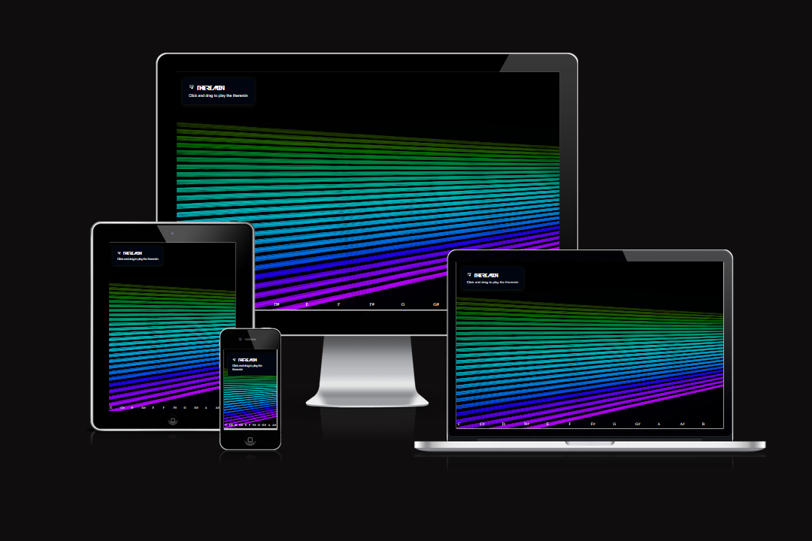

# Code Institute September Hackathon



[Link to Live Site](https://alvor1991.github.io/Hackathon-Team1/)

## Table Of Contents

- [The Hackathon](#the-hackathon)
- [Our Team](#our-team)
- [Our Project](#our-project)
- [User Stories](#user-stories)
- [Instructions](#instructions)
- [Deployment and Local Developement](#deployment-and-local-developement)
- [Credits](#credits)

## The Hackathon

A hackathon is an event, generally lasting a few days, where teams of programmers, designers, and developers collaborate intensively to build software or hardware projects. Participants often work on solving specific challenges or developing new ideas within a set timeframe. Hackathons encourage innovation, teamwork, and creative problem-solving, with the goal of producing functional prototypes or solutions by the event's end.

This months Hackathon is focused on the theme of music in recognition of September being Classical Music month.

The goals of the hackathon are to create one of the following projects:

- Build a digital Instrument
- Build a music game
- Build a music learning app

The judging criteria is as follows:

- The project is one of the three suggested apps
- The project goes above and beyond the given project ideas
- The project has a big focus on UX/UI
- The project has a basic readme
- The project is well planned and executed

## Our Team

- Ryan Nolan (Scrum Master) - https://github.com/Alvor1991/
- Jaimie Hemmings - https://github.com/JaimieHemmings
- Leon Potgieter - https://github.com/leonp84
- Sean Meade - https://github.com/sean-meade
- Grace YuGuo - https://github.com/Grace-YuGuo
- Tafadzwa Mangena - https://github.com/TafadzwaMangena

## Our Project

We decided to create a theremin for our hackathon project because it represents an innovative, hands-on way to blend technology and music. The theremin is unique as it's one of the few instruments played without physical contact, making it an interesting challenge to build. It allowed us to explore principles of electronics, sensor-based input, and creative coding, all while creating something interactive and fun to demonstrate.

Additionally, it allowed us to be creative in developing visuals to go along side and support the interactivity of our app. We chose Three.js for the background visuals in our theremin app because it's a powerful and lightweight JavaScript library for creating 3D graphics in the browser. It allows for real-time rendering of dynamic visuals, which pairs well with the interactive nature of the theremin. Three.js also offers a wide range of tools and flexibility, making it easy to create visually engaging and responsive backgrounds that can react to the music and movements of the theremin.

## User Stories

### User Story 1: Play Sound Using Mouse
**As a** website visitor,  
**I want to** be able to play theremin-style sound by clicking and moving the mouse on the webpage,  
**so that** I can interact with the instrument visually and audibly.

##### Acceptance Criteria:
- The mouse click initiates sound generation.
- Horizontal mouse movement changes the pitch of the sound.
- Vertical mouse movement changes the volume of the sound.
- Releasing the mouse stops the sound.

---

### User Story 2: Play Sound Using Touch (Mobile)
**As a** mobile user,  
**I want to** use touch gestures to play the theremin on my mobile device,  
**so that** I can experience the same interaction as desktop users while on a mobile phone or tablet.

#### Acceptance Criteria:
- Touch events (e.g., touch start) trigger the theremin sound.
- Horizontal touch movement changes the pitch.
- Vertical touch movement changes the volume.
- Releasing the touch (touch end) stops the sound.

---

### User Story 3: Display Visual Feedback for Interaction
**As a** user,  
**I want to** see visual feedback (such as a dot or visual indicator) while interacting with the theremin,  
**so that** I can visually track my movements and see how they affect the sound.

#### Acceptance Criteria:
- When the mouse is clicked or the screen is touched, a visual indicator appears at the interaction point.
- The visual indicator moves with the mouse or touch position.
- The visual indicator disappears when the interaction stops (mouse release or touch end).

---

### User Story 4: Responsive Design for Different Devices
**As a** user,  
**I want to** experience the website seamlessly on various screen sizes and devices,  
**so that** the theremin interaction feels consistent whether I'm on desktop, tablet, or mobile.

#### Acceptance Criteria:
- The website is responsive, adjusting layout and interaction areas based on the device.
- The touch area and clickable regions remain fully usable on smaller screens.
- Interaction is fluid on both mouse and touch-based devices.


## Instructions

A theremin is a very simple to use yet difficult to master intrument. By simply clicking anywhere on the screen the user will create a note relative to the cursor position. The pitch and volume of the note is dependent on the x and y position values of the cursor at any given time. Simply move the cursor up to increase volume and down to decrease volume, similarly, to increase pitch the user can simply move their cursor to the right of the screen and left to decrease pitch, resulting in a bassier tone.

## Deployment and Local Developement

### Deployment

We used GitHub pages for the deployment of this website

- Log in to GitHub (If you don't have an account you will need to register)
- Navigate to the [Repository](https://github.com/Alvor1991/Hackathon-Team1)
- Click "Settings"
- Find "Pages" in the left side vertical navigation menu
- Scroll down to the "Source" section
- Under "Select Branch" choose Main
- Select "Root" from the Select Folder Menu
- Click save, wait a few moments and the site will be deployed to GitHub pages

### Local Development

#### Forking

- Login to GitHub (Create an account if you do not have one)
- Navigate to the [Repository](https://github.com/Alvor1991/Hackathon-Team1)
- Click "Fork" at the top right

#### Cloning

- Login to GitHub (Create an account if you do not have one)
- Navigate to the [Repository](https://github.com/Alvor1991/Hackathon-Team1)
- Select Code from the top right
- Copy the link provided for your chosen cloning method (HTTPS, SSH, GitHub CLI)
- Navigate to s directory on your local environment where you want the project cloned
- Open a terminal in this directory
- Type ```Git Clone <Repo URL>``` and press enter

## Credits

### Resources

- [Three JS](https://threejs.org/) - Three JS is a fantastic lightweight JavaScript library enabling the use of 3d objects and shaders within the browser

- [MeshLine](https://github.com/spite/THREE.MeshLine) - A library for building triangle billboarded lines using Three JS. It is a replacement for Three JSs THREE.Line.

- [MDN Web Audio API](https://developer.mozilla.org/en-US/docs/Web/API/Web_Audio_API) - The MDN documentation of the web audio API was an invaluable resource for learning what was available and possible as well as in the implementation and use of the web audio API

- [Josh's CSS Reset](https://www.joshwcomeau.com/css/custom-css-reset/) - A simple but effective CSS reset

- [Devil Breeze](https://www.cdnfonts.com/devil-breeze.font) - Custom font from CDNFonts

- [Hover effect on mobile](https://stackoverflow.com/questions/35634226/javascript-detect-finger-moved-over-a-div) The solution to how to make the hover effect work on mobile was adapted from the answer in this stackoverflow question.

- [MixButton](https://mixbutton.com/mixing-articles/music-note-to-frequency-chart/) - Used to help us understand the specific frequencies for individual notes

- [W3Schools](https://www.w3schools.com/jsref/event_touchstart.asp) - Amazing resource for understanding and using touch events to make the website compatible with touch screen devices

- [GitHub](https://github.com/) - For version Control and hosting


### Acknowledgements

A big thank you to the Code Instute team and the volunteers that make the Code Institute Hackathon events possible every year